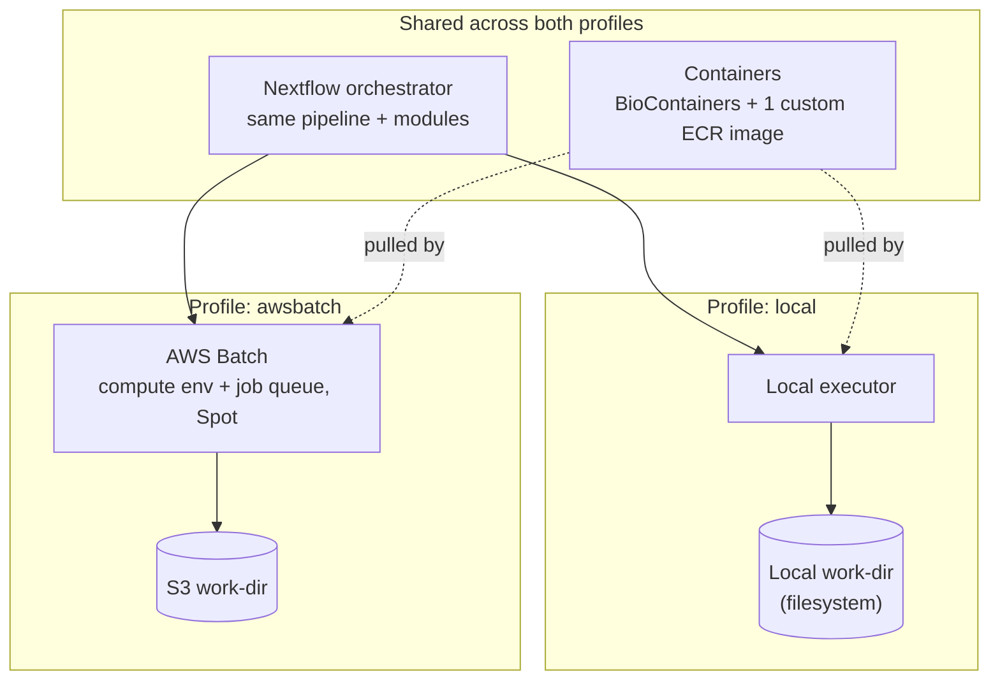

# Architecture — nf-varcall-cloud

> arc42-light. Stable big picture lives here; individual decisions → `adr/`.

## Context & Goals
A small, tested Nextflow pipeline (FASTQ → variants) that runs both locally with
containers and elastically on AWS Batch. The point of this repo is not the analysis
(standard), but demonstrating **local↔cloud parity, reproducibility, and
cost-awareness** in pipeline execution.

## Constraints
- Public data only, no patient data (CI on `nf-core/test-datasets`; cloud run on a
  downsampled GIAB sample, GRCh38).
- Scope limited to a small region (gene panel / chr20) to keep runtime and cost minimal.
- Built with a regulated-clinical lens (reproducibility, auditability) as the differentiator.

## Quality Goals (NFRs)
- **Reproducibility** — identical results local and on cloud; pinned containers.
- **Cost transparency** — every cloud run is cheap and observable (Spot, budget alarm, teardown).
- **Local↔cloud parity** — same pipeline; only the executor and work-dir change.

## Architecture

